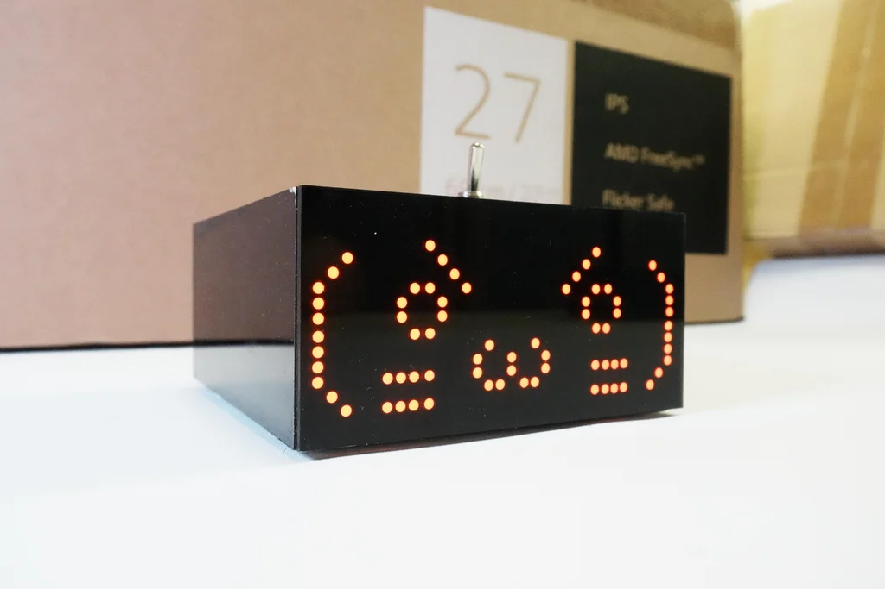

 

# Kawaii-Useless-Robot

A kawaii useless robot that runs away if you push it too hard

## Usage

There are three modes build into this robot. 

### Default Mode

Default mode is the mode where the robot interacts and response to switch pushing. To enter default mode, set the switch into the "OFF" position (lever pointing to the front-side of the robot) and power on the robot.

### AP Mode

AP mode is the mode where it will host a web server and you will be able to connect to it using mobile devices with a captive portal browser. 

For some devices like iPhone, you might need to disable mobile data and navigate to `http://192.168.4.1` with your browser to open the control panel. For most Android device, a captive portal notification should automatically pops up when you connects to it and ask you to sign in. The control UI will then be shown on the sign in captive portable browser if your network environment is valid.

### WiFi Debug Mode

You can enable WiFi (client) debug mode by setting `ENABLE_WIFI_DEBUG` to true with your home wifi crendentials.

```
#define ENABLE_WIFI_DEBUG false //Set to true to use WiFi Client mode for remote debugging
#define DEBUG_SSID "" //Debug SSID, usually your home WiFi SSID
#define DEBUG_PWD "" //Debug Password, your home WiFi Password
```

After this mode is enabled, you can connect to the web UI of the robot via your home local area network and debug any web interface issues.

## Prototype Video

[](https://youtu.be/l38ngzytmJw)


## Firmware Flashing

To flash firmware into this robot, open the top cover and use the type C port with a `</>` label for programming. The type C port at the back is for powering (and charging, if you builds has battery installed).


### Board Settings

ESP32 v2.014

- ESP32 Dev Module
- CPU Freq: 240Mhz
- Arduino & Events run on: Core 1
- Flash Mode: DIO

### Notes

Different version of ESP32 arduino core uses different version of RTOS. Thus, some version (specially the newer one) might have higher chances of crashing. After my testing, for the ESP32E I bought, the version v2.014 works the best. However, this might not be the same if you are getting an ESP32E with newer firmware.


## License

MIT License


